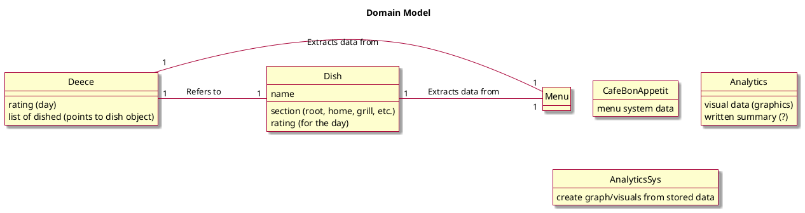
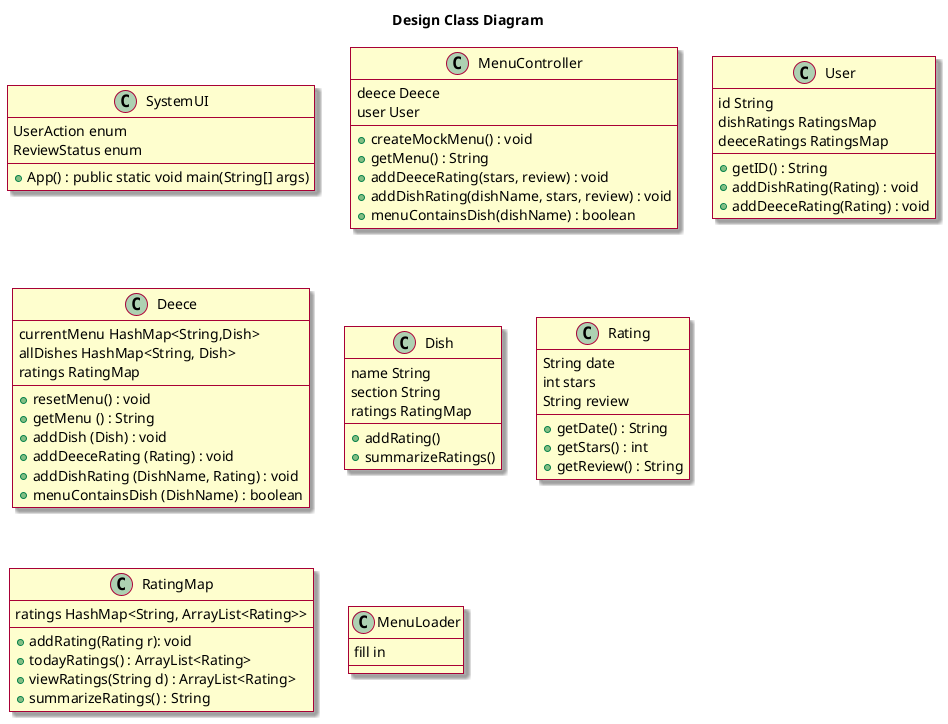
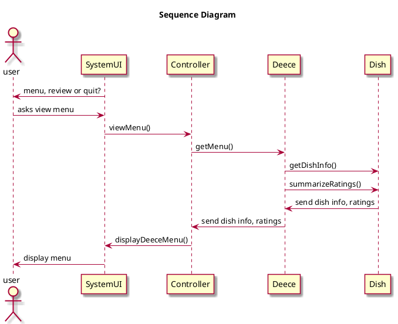
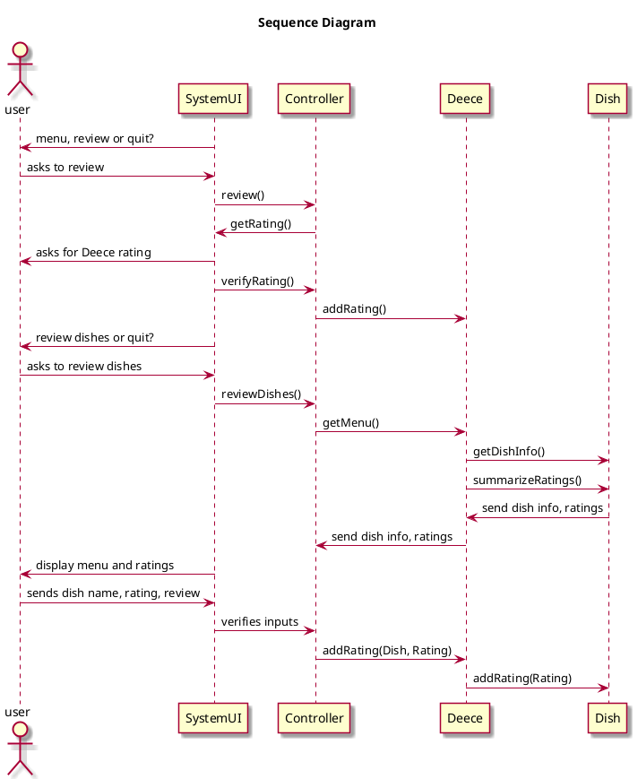
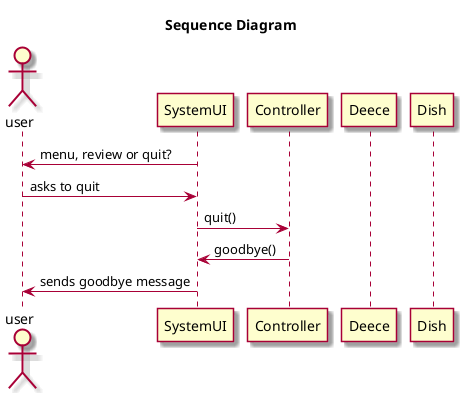

# Domain Model

```plantuml
@startuml

skin rose

title Domain Model

hide circle
hide empty methods

 
class Deece {
  rating (day)
  list of dished (points to dish object)
}

class CafeBonAppetit {
  menu system data
}

class Dish {
  name
  section (root, home, grill, etc.)
  rating (for the day)
}

class Analytics {
  visual data (graphics)
  written summary (?)
}

class AnalyticsSys {
  create graph/visuals from stored data
}

Deece "1" - "1" Dish : \tRefers to\t\t
Dish "1" - "1" Menu : \tExtracts data from \t\t
Deece "1" - "1" Menu : \tExtracts data from \t\t
@enduml
```
# Design Class Diagram

```plantuml
@startuml

skin rose

title Design Class Diagram

class SystemUI {
 UserAction enum
 ReviewStatus enum
 
 +App() : public static void main(String[] args)
}

class MenuController {
 deece Deece
 user User
 + createMockMenu() : void
 + getMenu() : String
 + addDeeceRating(stars, review) : void
 + addDishRating(dishName, stars, review) : void
 + menuContainsDish(dishName) : boolean
}

class User {
    id String
    dishRatings RatingsMap
    deeceRatings RatingsMap
    + getID() : String
    + addDishRating(Rating) : void
    + addDeeceRating(Rating) : void
}

class Deece {
  currentMenu HashMap<String,Dish>
  allDishes HashMap<String, Dish>
  ratings RatingMap
  + resetMenu() : void
  + getMenu () : String
  + addDish (Dish) : void
  + addDeeceRating (Rating) : void
  + addDishRating (DishName, Rating) : void
  + menuContainsDish (DishName) : boolean
}

class Dish {
  name String
  section String
  ratings RatingMap
  + addRating()
  + summarizeRatings()
}

class Rating {
    String date
    int stars
    String review
    --
    + getDate() : String
    + getStars() : int
    + getReview() : String
}

class RatingMap {
    ratings HashMap<String, ArrayList<Rating>>
    + addRating(Rating r): void
    + todayRatings() : ArrayList<Rating>
    + viewRatings(String d) : ArrayList<Rating>
    + summarizeRatings() : String
}

class MenuLoader {
    fill in
}

@enduml
```
# Sequence Diagram - Get Menu

```plantuml
@startuml

skin rose

title Sequence Diagram

Actor user
Participant SystemUI
Participant Controller
Participant Deece
Participant Dish

SystemUI -> user: menu, review or quit?
user -> SystemUI: asks view menu
SystemUI -> Controller: viewMenu()
Controller -> Deece: getMenu()
Deece -> Dish: getDishInfo()
Deece -> Dish: summarizeRatings()
Dish -> Deece: send dish info, ratings
Deece -> Controller: send dish info, ratings
Controller -> SystemUI: displayDeeceMenu()
SystemUI -> user: display menu


@enduml
```

# Sequence Diagram - Review

```plantuml
@startuml

skin rose

title Sequence Diagram

Actor user
Participant SystemUI
Participant Controller
Participant Deece
Participant Dish

SystemUI -> user: menu, review or quit?
user -> SystemUI: asks to review
SystemUI -> Controller: review()
Controller -> SystemUI: getRating()
SystemUI -> user: asks for Deece rating
SystemUI -> Controller: verifyRating()
Controller -> Deece: addRating()
SystemUI -> user: review dishes or quit?
user -> SystemUI: asks to review dishes
SystemUI -> Controller: reviewDishes()
Controller -> Deece: getMenu()
Deece -> Dish: getDishInfo()
Deece -> Dish: summarizeRatings()
Dish -> Deece: send dish info, ratings
Deece -> Controller: send dish info, ratings
SystemUI -> user: display menu and ratings
user -> SystemUI: sends dish name, rating, review
SystemUI -> Controller: verifies inputs
Controller -> Deece: addRating(Dish, Rating)
Deece -> Dish: addRating(Rating)

@enduml
```

# Sequence Diagram - Quit

```plantuml
@startuml

skin rose

title Sequence Diagram

Actor user
Participant SystemUI
Participant Controller
Participant Deece
Participant Dish

SystemUI -> user: menu, review or quit?
user -> SystemUI: asks to quit
SystemUI -> Controller: quit()
Controller -> SystemUI: goodbye()
SystemUI -> user: sends goodbye message

@enduml
```