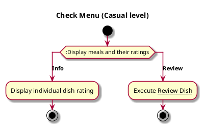

# Check Menu

## 1. Primary actor and goals

__Student user__: wants to see menu options and rating of options. Wants fast, easy, informative and easy to navigate.

## 2. Other stakeholders and their goals

Not applicable.

## 3. Preconditions

In order to reach this screen, user needs to click menu from the start screen. 

## 4. Postconditions

No relevant postconditions.

## 5. Workflow

