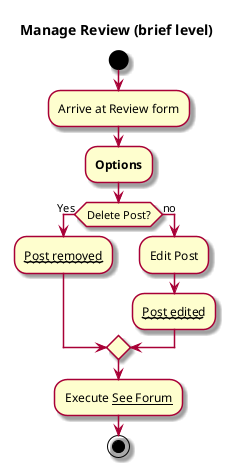

# Manage Review

## 1. Primary actor and goals

__Student user__: wants to edit or delete their past reviews/ratings.

## 2. Other stakeholders and their goals

Not applicable.

## 3. Preconditions

* Able to delete numerical & written reviews
* Able to edit previous reviews.
* Able to delete/edit reactions/votes

## 4. Postconditions

* Deleted review must not be visible to anybody
* Edited review must be updated for every user to see

## 5. Workflow

