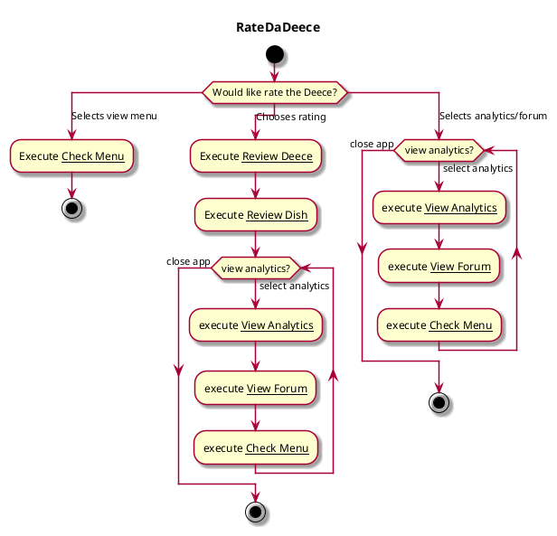

# Navigate System

## 1. Primary actor and goals

__Student user__: wants to see dish and overall trends in ratings. Focus on clarity to promote fun and intuitive experience.
Suggested workflow on how to navgiate our system. 

## 2. Other stakeholders and their goals

Not applicable.

## 3. Preconditions

No preconditions except those associated with the use cases. Can be seen in diagram.

## 4. Postconditions

No postconditions except those associated with workcases. 

## 5. Workflow

Although this workflow is repetitive, wanted to avoid 
using an if-case because wanted to stress that these three 
cases all come from selecting different options in the inital menu.
While using a if-case may have reduced creating two "view analytics?"
loops, doing so makes the three inital cases clear and have included 
the code I tried commented out in the bottom for reference. 




[//]: # (```plantuml)

[//]: # ()
[//]: # (@startuml)

[//]: # ()
[//]: # (skin rose)

[//]: # (title RateDaDeece)

[//]: # ()
[//]: # (start)

[//]: # (switch &#40;Would like rate the Deece?&#41;)

[//]: # ( case &#40;Selects view menu&#41;)

[//]: # ( :Execute __Check Menu__;)

[//]: # ( stop)

[//]: # ()
[//]: # ( case &#40;Chooses rating or view analytics & forum&#41;)

[//]: # ( if &#40;Rating or Analytics?&#41; then &#40;Chooses rating&#41;)

[//]: # ( :Execute __Review Deece__;)

[//]: # ( :Execute __Review Dish__;)

[//]: # ( &#40;selects analytics & forum&#41; elseif &#40;analytics & forum&#41;)

[//]: # ( endif)

[//]: # ( while &#40;view analytics?&#41;  is &#40;select analytics&#41;)

[//]: # ( :execute __View Analytics__;)

[//]: # ( :execute __View Forum__;)

[//]: # ( :execute __Check Menu__;)

[//]: # ( endwhile &#40;close app&#41;)

[//]: # ( stop)

[//]: # ( )
[//]: # (endswitch)

[//]: # ()
[//]: # (@enduml)

[//]: # (```)