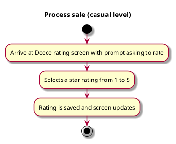

# Review Deece

## 1. Primary actor and goals

__Student user__: wants to leave a review on the overall quality of Deece. Wants to be easy and fun and know that their vote is being counted
and part of a broader user base.

## 2. Other stakeholders and their goals

Not applicable.

## 3. Preconditions

User has not reviewed the meal time already (allowed three reviews during breakfast, lunch and dinner).

## 4. Postconditions

Reviews need to be saved and processed by the system. 

## 5. Workflow

