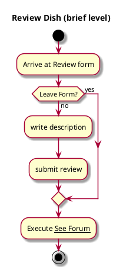

# Review Dish

## 1. Primary actor and goals

__Student user__: wants to leave a review on the quality of individual dishes at Deece. Wants to be easy and fun. Ability to leave numerical and written review.

## 2. Other stakeholders and their goals

Not applicable.

## 3. Preconditions

* User must have reviewed overall deece before reviewing a dish
* User must have found a dish on the menu before reviewing it.

## 4. Postconditions

* Needs to save the rating the user left
* Must be able to use and process this data for analytics
* Needs to be able to process review to display on the forum

## 5. Workflow

