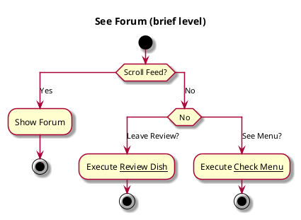

# See Forum

## 1. Primary actor and goals

__Student user__: wants to see previous reviews/ratings. Able to interact with individual reviews. Able to leave a review 

## 2. Other stakeholders and their goals

Not applicable.

## 3. Preconditions

* Able to store and load numerical & written reviews
* Able to store and load reactions/votes

## 4. Postconditions

* Must be able to update as more reviews & votes come in in real time
* Able to store reactions/votes

## 5. Workflow

