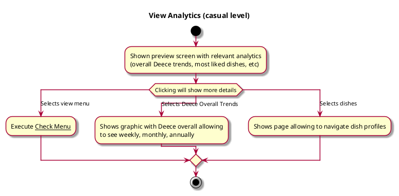

# View Analytics

## 1. Primary actor and goals

__Student user__: wants to see dish and overall trends in ratings. Focus on clarity to promote fun and intuitive experience.

## 2. Other stakeholders and their goals

__Cafe Bon Appetit__: Would likely want to pay attention to the app in order to help collect data on performanc.

## 3. Preconditions

No preconditions, but if chooses to review Deece and dishes needs to complete those screens.

## 4. Postconditions

No postconditions.

## 5. Workflow

