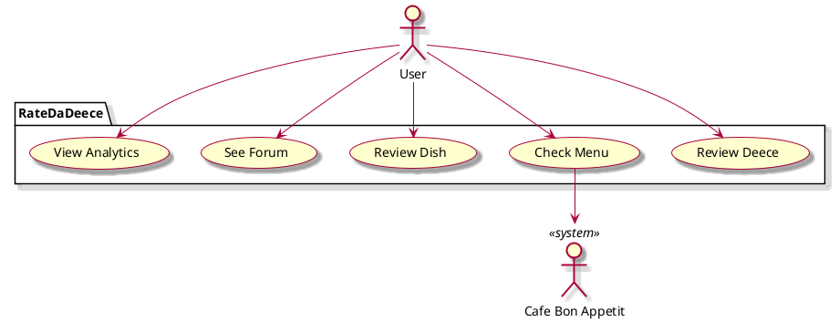

# Vision Document

# Introduction

We envision an easy-to-use, highly responsive app that allows users to have an enjoyable experience rating the Vassar Dining Experience. Primarily an app to rate dishes and overall dining experience, the app should have a built-in forum and analytics page to promote discussion and help the user understand trends.

# Business Case

Our dining hall app is able to appeal to the student population by not focusing primarily on functionality, rather through its focus on being easy and fun.

1. Using a simple interface, app can promote quick ratings improving the total data collection
2. Through integrating a forum and analytics, the app allow people to express their general feelings on the different dishes creating a social aspect
3. Using the menu containing ratings on specific dishes, users can better guide their meal choices

# Key Functionality
* Rating quantitatively and descriptively
* Real time menu updating using Cafe Bon Appetit
* Anonymous profiles (w/ email verification)
* Dish profiles
* Reddit-Style review forum with trend analytics

# Stakeholder goals summary

* User: write reviews, see other reviews, check menu, visualize dish trends
* Cafe Bon Appetit: provide real time menu updates, increase use of their menu

